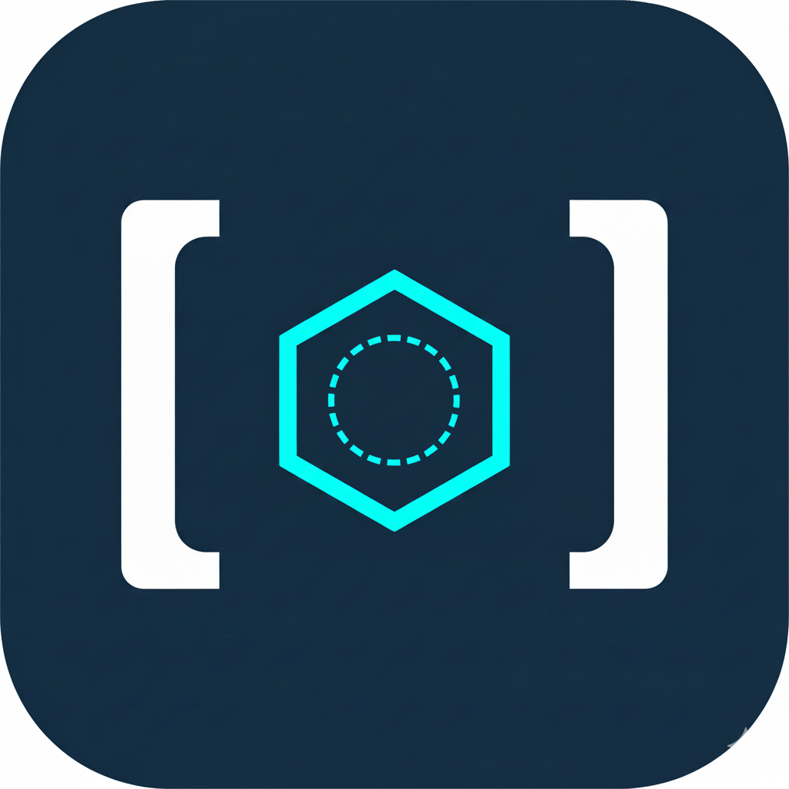

# Introlix

<div align="center" id="introlix">

<!-- Add your logo here -->
<!--  -->

**An AI-powered research platform that transforms how you conduct research**

[](https://opensource.org/licenses/Apache-2.0)
[](https://www.python.org/downloads/)
[](https://nextjs.org/)
[](https://fastapi.tiangolo.com/)

[Features](#features) • [Quick Start](#quick-start) • [Documentation](#documentation) • [Contributing](#contributing)

</div>

---

## 🌟 Overview

Introlix is an intelligent research platform that combines the power of AI agents with advanced search capabilities to streamline your research workflow. Whether you're conducting academic research, market analysis, or deep investigations, Introlix provides a comprehensive suite of tools to help you gather, organize, and synthesize information efficiently.

### Key Capabilities

- **AI-Powered Research Desk**: Multi-stage AI-guided research workflow with context gathering, planning, and exploration
- **Intelligent Chat Interface**: Conversational AI with internet search integration for real-time information
- **AI Document Editor**: Edit and enhance your research documents with AI assistance
- **Advanced Search Integration**: Powered by SearXNG for privacy-focused web searches
- **Knowledge Management**: Vector-based storage with Pinecone for semantic search
- **Multi-Agent System**: Specialized agents for different research tasks (Context, Planner, Explorer, Editor, Writer)

---
<div id="features"></div>

## ✨ Features

### Research Desk Workflow

The Research Desk guides you through a comprehensive research process:

1. **Initial Setup**: Create a research desk with your topic
2. **Context Agent**: AI asks clarifying questions to understand your research scope
3. **Planner Agent**: Generates a structured research plan with topics and keywords
4. **Explorer Agent**: Automatically searches the internet and gathers relevant information
5. **Document Editing**: AI-assisted writing and editing of your research document
6. **Interactive Chat**: Ask questions about your research and get AI-powered answers

### Chat Interface

- Real-time conversational AI with streaming responses
- Internet search integration for up-to-date information
- Conversation history persistence
- Support for multiple LLM providers (OpenRouter, Google AI Studio)

### Document Management

- Rich text editor powered by Lexical
- AI-assisted editing and content generation
- Workspace organization for multiple projects
- Auto-save and version tracking

### Coming Soon (Beta Features)

- **Document Formatting**: Export research as blog posts, research papers, or custom formats
- **Reference Management**: Automatic citation generation with inline references [1], [2], etc.

---

<div id="quick-start"></div>

## 🚀 Quick Start

### Prerequisites

- **Python**: 3.11 or higher
- **Node.js**: 18 or higher
- **pnpm**: Package manager for frontend
- **MongoDB**: Database for storing workspaces and research data
- **Pinecone**: Vector database for semantic search
- **SearXNG**: Self-hosted search engine (see [SearXNG Setup](#searxng-setup))

### Installation

1. **Clone the repository**

```bash
git clone https://github.com/introlix/introlix.git
cd introlix
```

2. **Set up environment variables**

```bash
cp .env.example .env
```

Edit `.env` and add your API keys:

```env
# Required: Choose one LLM provider
OPEN_ROUTER_KEY=your_openrouter_api_key_here
# OR
GEMINI_API_KEY=your_gemini_api_key_here # From Google AI Studio

# Required: Search engine
SEARCHXNG_HOST=http://localhost:8080/search

# Required: Vector database
PINECONE_KEY=your_pinecone_api_key_here

# Required: Database
MONGO_URI=mongodb://localhost:27017/introlix
```

3. **Install Python dependencies**

```bash
# Create virtual environment
python -m venv .venv
source .venv/bin/activate  # On Windows: .venv\Scripts\activate

# Install dependencies
pip install -e .
```

4. **Authenticate with Hugging Face** (required for LLM model downloads)

```bash
pip install huggingface_hub
# Login to Hugging Face
hf auth login

# Or set token directly
export HUGGING_FACE_HUB_TOKEN=your_hf_token_here
```

> **Note**: Get your Hugging Face token from [https://huggingface.co/settings/tokens](https://huggingface.co/settings/tokens)

5. **Install frontend dependencies**

```bash
cd web
pnpm install
```

6. **Start the services**

**Terminal 1 - Backend:**
```bash
# From project root
source .venv/bin/activate
uvicorn app:app --reload --port 8000
```

**Terminal 2 - Frontend:**
```bash
cd web
pnpm dev
```

7. **Access the application**

- Frontend: http://localhost:3000
- Backend API: http://localhost:8000
- API Documentation: http://localhost:8000/docs

---

## 🔧 Configuration

### LLM Provider Selection

Edit `introlix/config.py` to choose your LLM provider:

```python
# Choose: "openrouter" or "google_ai_studio"
CLOUD_PROVIDER = "google_ai_studio"

# Set default model
if CLOUD_PROVIDER == "openrouter":
    AUTO_MODEL = "qwen/qwen3-235b-a22b:free"
elif CLOUD_PROVIDER == "google_ai_studio":
    AUTO_MODEL = "gemini-2.5-flash"
```

<div id="searxng-setup"></div>

### SearXNG Setup

SearXNG is a privacy-respecting metasearch engine. For Introlix to work properly, you need to configure it to return JSON results.

To install SearXNG, see  [Installation guide](https://docs.searxng.org/admin/installation.html).

Modify `searxng/settings.yml`:

```yaml
# SearXNG settings

use_default_settings: true

general:
  debug: false
  instance_name: "SearXNG"

search:
  safe_search: 2
  autocomplete: 'duckduckgo'
  formats:
    - html
    - json # Important Enable Json Format

server:
  # Is overwritten by ${SEARXNG_SECRET}
  secret_key: "ultrasecretkey"
  limiter: true
  image_proxy: true
  # public URL of the instance, to ensure correct inbound links. Is overwritten
  # by ${SEARXNG_BASE_URL}.
  # base_url: http://example.com/location

valkey:
  # URL to connect valkey database. Is overwritten by ${SEARXNG_VALKEY_URL}.
  url: valkey://localhost:6379/0
```
For full template see, [searxng/blob/main/searx/settings.yml](https://github.com/introlix/searxng/blob/main/searx/settings.yml)

3. **Start SearXNG**

```bash
docker-compose up -d # (RECOMMENDED) if your using docker 

OR

python searx/webapp.py
```

4. **Verify JSON output**

Test that JSON format works:
```bash
curl "http://localhost:8080/search?q=test&format=json"
```

You should receive a JSON response with search results.

**Important**: Make sure to enable JSON format in your SearXNG settings as shown above. Introlix requires JSON responses from SearXNG to function properly.

---

<div id="documentation"></div>

## 📚 Documentation

- [API Documentation](./docs/API.md) - REST API reference
- [Architecture](./docs/ARCHITECTURE.md) - System design and components
- [Development Guide](./docs/DEVELOPMENT.md) - Contributing and development setup
- [SearXNG Setup](#searxng-setup) - Detailed search engine configuration
- [Quick Reference](./docs/QUICK_REFERENCE.md) - Common commands and tips

---

## 🏗️ Architecture

Introlix is built with a modern, scalable architecture:

### Backend (Python/FastAPI)

- **FastAPI**: High-performance async web framework
- **Multi-Agent System**: Specialized AI agents for different tasks
  - `ChatAgent`: Conversational interface with search
  - `ContextAgent`: Gathers research context through questions
  - `PlannerAgent`: Creates structured research plans
  - `ExplorerAgent`: Searches and gathers information
  - `EditAgent`: AI-assisted document editing
  - `WriterAgent`: Content generation and synthesis
- **Vector Storage**: Pinecone for semantic search
- **Database**: MongoDB for data persistence

### Frontend (Next.js/React)

- **Next.js 15**: React framework with App Router
- **Lexical**: Rich text editor
- **TanStack Query**: Data fetching and caching
- **Radix UI**: Accessible component primitives
- **Tailwind CSS**: Utility-first styling

### External Services

- **LLM Providers**: OpenRouter or Google AI Studio
- **Search**: SearXNG (self-hosted)
- **Vector DB**: Pinecone
- **Database**: MongoDB

---

<div id="contributing"></div>

## 🤝 Contributing

We welcome contributions! Please see our [Contributing Guide](./docs/CONTRIBUTING.md) for details on:

- Setting up your development environment
- Code style and standards
- Submitting pull requests
- Reporting bugs and requesting features

---

## 📝 License

This project is licensed under the Apache License 2.0 - see the [LICENSE](LICENSE) file for details.

---

## 🙏 Acknowledgments

- Built with [FastAPI](https://fastapi.tiangolo.com/)
- Frontend powered by [Next.js](https://nextjs.org/)
- Rich text editing with [Lexical](https://lexical.dev/)
- Search powered by [SearXNG](https://github.com/searxng/searxng)
- Vector storage by [Pinecone](https://www.pinecone.io/)

---

## 📧 Contact & Support

- **Issues**: [GitHub Issues](https://github.com/introlix/introlix/issues)
- **Discussions**: [GitHub Discussions](https://github.com/introlix/introlix/discussions)
- **Community**: [Join our Discord](https://discord.gg/mhyKwfVm)

---

<div align="center">

**[⬆ back to top](#introlix)**

Made with ❤️ by the Introlix Team

</div>
